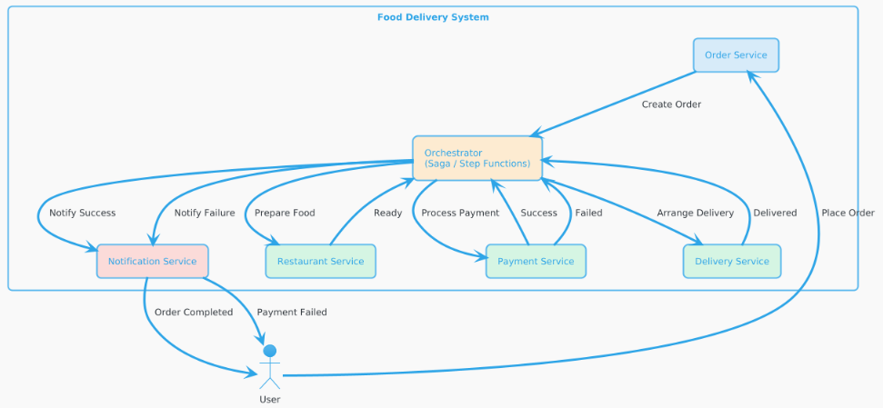
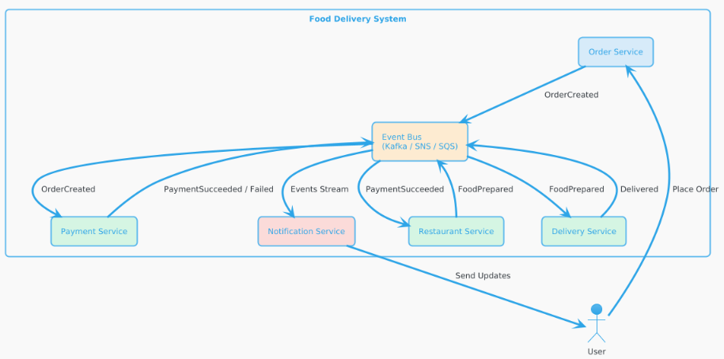

# 1. Event Choreography (phi tập trung)

Không có service trung tâm, các service giao tiếp qua event (pub/sub)

## Luồng hoạt động

1. Order Service tạo đơn → publish `OrderCreated`
2. Payment Service nghe → xử lý → publish `PaymentSucceeded` / `PaymentFailed`
3. Restaurant Service nghe → chuẩn bị món → publish `FoodPrepared`
4. Delivery Service nghe → giao hàng → publish `Delivered`
5. Notification Service nghe các event → gửi thông báo

## Mermaid Diagram

---

# 2. Event Orchestration (có orchestrator)

Có 1 service trung tâm điều phối toàn bộ workflow

## Luồng hoạt động

1. Order Service gửi request tới Orchestrator
2. Orchestrator gọi:

   * Payment Service
   * Restaurant Service
   * Delivery Service
3. Xử lý retry / rollback nếu lỗi
4. Gửi trạng thái cuối

## PlantUML Diagram

---

# 3. So sánh 2 mô hình

| Tiêu chí       | Choreography     | Orchestration          |
| -------------- | ---------------- | ---------------------- |
| Coupling       | Thấp             | Cao hơn                |
| Độ phức tạp    | Ẩn (phân tán)    | Rõ ràng (tập trung)    |
| Debug          | Khó              | Dễ                     |
| Scalability    | Rất tốt          | Tốt                    |
| Resilience     | Cao (không SPOF) | Phụ thuộc orchestrator |
| Thay đổi logic | Khó kiểm soát    | Dễ quản lý             |
| Monitoring     | Khó              | Dễ                     |

---

# 4. Ưu / Nhược điểm

## Event Choreography

**Ưu điểm**

* Loose coupling
* Scale cực tốt
* Không có single point of failure
* Phù hợp hệ thống lớn, distributed

**Nhược điểm**

* Logic bị phân tán → khó hiểu
* Debug rất khó (event chain dài)
* Dễ bị “event spaghetti”

---

## Event Orchestration

**Ưu điểm**

* Control flow rõ ràng
* Dễ debug & monitor
* Dễ implement business logic phức tạp (retry, rollback)

**Nhược điểm**

* Orchestrator = single point of failure (nếu không HA)
* Coupling cao hơn
* Scale bị phụ thuộc orchestrator

---

# 5. Quyết định cho hệ thống Food Delivery

## Khi nên dùng Choreography

* Hệ thống lớn (GrabFood, ShopeeFood)
* Nhiều service độc lập
* Cần scale cực mạnh
* Ưu tiên resilience

## Khi nên dùng Orchestration

* Business logic phức tạp (voucher, combo, retry logic)
* Team nhỏ / dễ maintain
* Cần audit + tracking rõ ràng

---

